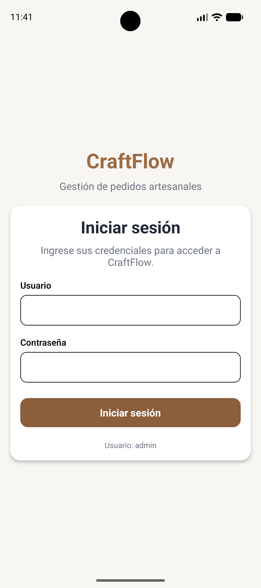
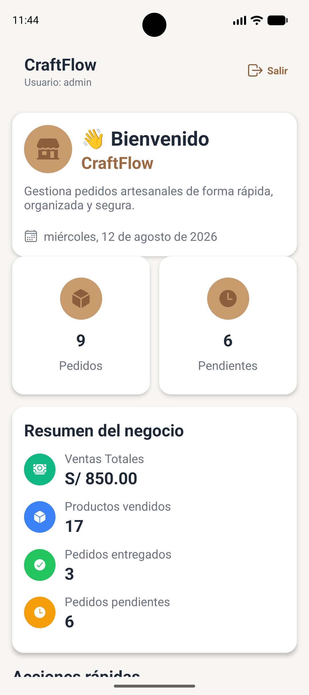
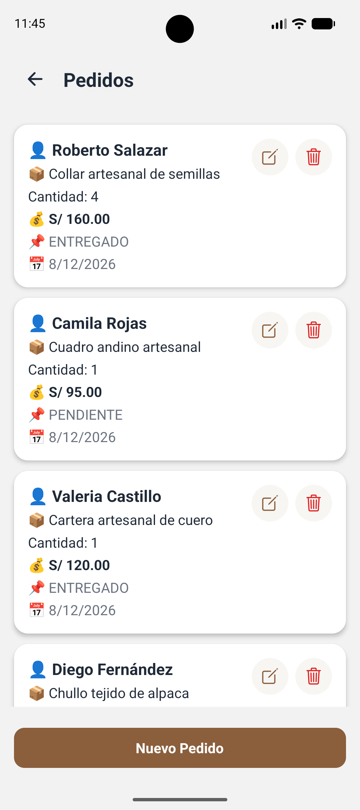
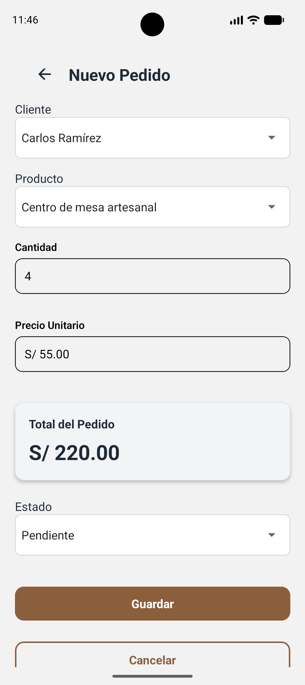
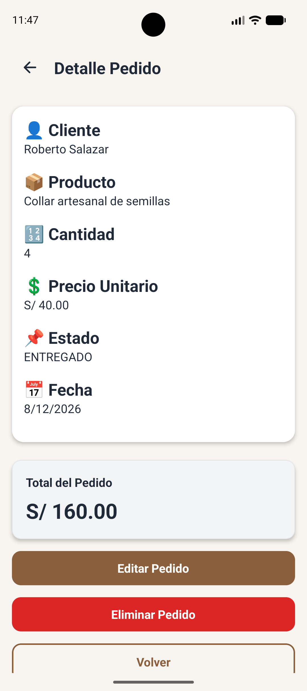
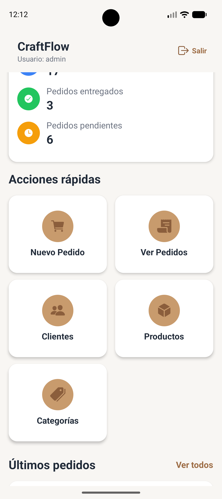

# 🛍️ CraftFlow

### Sistema móvil para la gestión de productos y pedidos artesanales

<p align="center">
  <strong>Aplicación móvil desarrollada con React Native + Expo + TypeScript</strong>
</p>

<p align="center">
  Gestión de clientes · Categorías · Productos · Pedidos · Dashboard · API REST · SQLite
</p>

---

## 📌 Descripción

**CraftFlow** es una aplicación móvil orientada a la gestión integral de pedidos para negocios dedicados a la comercialización de productos artesanales.

La aplicación permite administrar clientes, categorías, productos y pedidos desde una interfaz móvil, proporcionando un dashboard con indicadores de gestión y utilizando **SQLite para la persistencia local**.

El proyecto incorpora además una **API REST desarrollada con Node.js y Express**, permitiendo consultar y sincronizar información mediante endpoints HTTP.

La solución está diseñada para ejecutarse en dispositivos Android mediante **Expo / React Native**.

---

## 🎯 Objetivo del proyecto

Desarrollar una aplicación móvil que permita centralizar y facilitar la gestión de pedidos de un negocio artesanal, reduciendo la dependencia de registros manuales y proporcionando información organizada para la toma de decisiones.

### Objetivos específicos

- Gestionar clientes.
- Gestionar categorías.
- Gestionar productos.
- Registrar pedidos.
- Consultar pedidos registrados.
- Editar y visualizar el detalle de los pedidos.
- Controlar el estado de los pedidos.
- Visualizar indicadores mediante un dashboard.
- Mantener información mediante SQLite.
- Exponer información mediante una API REST.
- Preparar una versión APK para Android.

---

# 🚀 Funcionalidades

## 🔐 Autenticación

- Inicio de sesión.
- Validación de acceso.
- Gestión de sesión.
- Cierre de sesión.

## 👥 Gestión de clientes

- Registro de clientes.
- Listado de clientes.
- Consulta de información.
- Edición de clientes.
- Eliminación de clientes.

## 🏷️ Gestión de categorías

- Registro de categorías.
- Listado de categorías.
- Edición de categorías.
- Eliminación de categorías.

## 📦 Gestión de productos

- Registro de productos.
- Asociación con categorías.
- Consulta de productos.
- Edición de productos.
- Eliminación de productos.
- Gestión de precios.

## 🛒 Gestión de pedidos

- Creación de pedidos.
- Selección de cliente.
- Selección de producto.
- Definición de cantidad.
- Cálculo del precio unitario.
- Cálculo automático del total.
- Control del estado del pedido.
- Consulta del detalle.
- Edición de pedidos.

## 📊 Dashboard

El dashboard permite visualizar indicadores como:

- Total de pedidos.
- Pedidos pendientes.
- Pedidos entregados.
- Ventas totales.
- Productos vendidos.

---

# 🖥️ Pantallas principales

## Login

Pantalla de autenticación del usuario.

Las credenciales configuradas actualmente en el proyecto son:

Usuario: admin

Contraseña: CraftFlow2026



---

## Dashboard

Panel principal con indicadores de gestión.



---

## Listado de pedidos

Permite consultar los pedidos registrados y su estado.



---

## Crear pedido

Formulario para registrar nuevos pedidos.



---

## Detalle / edición del pedido

Permite consultar y modificar la información del pedido.



---


## Cerrar sesión

La aplicación permite cerrar la sesión y regresar al Login.



---

# 🏗️ Arquitectura

La solución está organizada en dos componentes principales:

```text
                         CRAFTFLOW
                             │
              ┌──────────────┴──────────────┐
              │                             │
              ▼                             ▼
      📱 Aplicación móvil              🌐 API REST
       React Native + Expo           Node.js + Express
              │                             │
              ▼                             ▼
          SQLite                       Puerto 3000
              │                             │
              └──────────────┬──────────────┘
                             │
                       Sincronización
                             │
                             ▼
                      Datos de negocio
```

### Componentes

| Componente | Tecnología |
|---|---|
| Aplicación móvil | React Native |
| Framework | Expo |
| Lenguaje | TypeScript |
| Navegación | React Navigation |
| Persistencia local | SQLite |
| API | Node.js + Express |
| Formato de intercambio | JSON |
| Plataforma objetivo | Android |
| Generación APK | EAS Build |

---

# 🛠️ Tecnologías utilizadas

## Frontend / Mobile

- React Native
- Expo
- TypeScript
- React Navigation
- Expo SQLite

## Backend

- Node.js
- Express.js
- JavaScript
- API REST
- JSON

## Herramientas

- Git
- GitHub
- Visual Studio Code
- Android Studio
- Expo Go
- EAS

---

# 🗄️ Persistencia local

CraftFlow utiliza **SQLite** para almacenar información localmente.

### Entidades principales

```text
Clientes
Categorías
Productos
Pedidos
```

### Tabla `pedidos`

La tabla de pedidos utiliza los siguientes campos:

```text
id
clienteId
productoId
cantidad
precioUnitario
total
estado
fecha
```
---

# 🌐 API REST

CraftFlow incorpora una API REST desarrollada con **Node.js + Express**.

## URL base

```text
http://localhost:3000
```

## Health Check

```http
GET /api/health
```

Respuesta:

```json
{
  "status": "ok",
  "service": "CraftFlow API REST",
  "version": "1.0.0"
}
```

---

## Endpoints

### Clientes

```http
GET /api/clientes
```

### Categorías

```http
GET /api/categorias
```

### Productos

```http
GET /api/productos
```

### Pedidos

```http
GET /api/pedidos
```

### Dashboard

```http
GET /api/dashboard
```

---

# 📡 Ejemplo de respuesta del Dashboard

```json
{
  "totalPedidos": 5,
  "pedidosPendientes": 4,
  "pedidosEntregados": 1,
  "ventasTotales": 375,
  "productosVendidos": 9
}
```

---

# 📱 Ejecución en Android

La aplicación fue preparada para ejecutarse en Android mediante Expo.

### Iniciar aplicación

Desde la raíz del proyecto:

```bash
npm install
```

Luego:

```bash
npx expo start
```

Para limpiar la caché de Metro:

```bash
npx expo start --clear
```

---

# 🌐 Ejecutar la API REST

Ingresar a la carpeta:

```bash
cd api
```

Instalar dependencias:

```bash
npm install
```

Iniciar el servidor:

```bash
npm start
```

La API quedará disponible en:

```text
http://localhost:3000
```

---

# 🔄 Pruebas de API

Una vez iniciada la API se pueden probar los siguientes endpoints:

```text
http://localhost:3000/api/health

http://localhost:3000/api/clientes

http://localhost:3000/api/categorias

http://localhost:3000/api/productos

http://localhost:3000/api/pedidos

http://localhost:3000/api/dashboard
```

---

# 📦 Generación del APK

CraftFlow incluye configuración para generar una versión APK para Android mediante EAS.

Ejecutar:

```bash
npx eas build --platform android --profile preview
```

El perfil `preview` está destinado a generar una versión instalable de prueba.

---

# 📸 Evidencias del proyecto

Las evidencias visuales se almacenan dentro de:

```text
docs/screenshots/
```

### Evidencias mínimas

| N.º | Evidencia | Archivo |
|---:|---|---|
| 1 | Login | `login.png` |
| 2 | Dashboard | `dashboard.png` |
| 3 | Listado de pedidos | `pedidos.png` |
| 4 | Crear pedido | `crear-pedido.png` |
| 5 | Detalle / edición | `detalle-pedido.png` |
| 6 | Perfil de usuario | `perfil.png` |
| 7 | Cerrar sesión | `cerrar-sesion.png` |
| 8 | API REST | `api-rest.png` |
| 9 | SQLite | `sqlite.png` |
| 10 | Aplicación Android | `android.png` |
| 11 | Servidor API | `api-server.png` |

---

# 📁 Estructura del proyecto

```text
CraftFlow/
│
├── api/
│   ├── data/
│   ├── package.json
│   ├── server.js
│   └── README.md
│
├── assets/
│
├── src/
│   ├── components/
│   ├── database/
│   ├── navigation/
│   ├── screens/
│   ├── services/
│   └── ...
│
├── docs/
│   └── screenshots/
│       ├── login.png
│       ├── dashboard.png
│       ├── pedidos.png
│       ├── crear-pedido.png
│       ├── detalle-pedido.png
│       ├── perfil.png
│       ├── cerrar-sesion.png
│       ├── api-rest.png
│       ├── sqlite.png
│       ├── android.png
│       └── api-server.png
│
├── App.tsx
├── app.json
├── eas.json
├── index.ts
├── package.json
├── package-lock.json
├── tsconfig.json
└── README.md
```

---

# 🧪 Datos de prueba

Para validar el funcionamiento de la aplicación se pueden utilizar registros de prueba para:

- 5 categorías.
- 5 clientes.
- 5 productos.
- 5 pedidos.

Ejemplo de productos:

| Producto | Categoría | Precio |
|---|---|---:|
| Chullo tejido de alpaca | Tejidos | S/ 50.00 |
| Cartera artesanal de cuero | Cuero | S/ 120.00 |
| Florero decorativo de cerámica | Cerámica Decorativa | S/ 75.00 |
| Cuadro andino artesanal | Arte Andino | S/ 95.00 |
| Collar artesanal de semillas | Accesorios | S/ 40.00 |

---

# 🔒 Seguridad

El proyecto utiliza un archivo `.gitignore` para evitar subir archivos innecesarios o sensibles al repositorio.

Entre ellos:

```text
node_modules/
.env
.env*.local
.expo/
*.db
*.sqlite
```

No se deben almacenar credenciales, contraseñas, tokens o claves privadas dentro del repositorio.

---

# 🚀 Flujo de trabajo Git

Clonar el proyecto:

```bash
git clone https://github.com/santiman0408-sudo/CraftFlow2026.git
```

Entrar al proyecto:

```bash
cd CraftFlow2026
```

Instalar dependencias:

```bash
npm install
```

Crear una rama para trabajar:

```bash
git checkout -b feature/nueva-funcionalidad
```

Guardar cambios:

```bash
git add .
```

Crear commit:

```bash
git commit -m "feat: nueva funcionalidad"
```

Subir cambios:

```bash
git push origin feature/nueva-funcionalidad
```

---

# 👥 Trabajo colaborativo

El proyecto se encuentra alojado en GitHub y puede utilizarse como repositorio colaborativo.

Repositorio:

**CraftFlow2026**

Los colaboradores pueden trabajar mediante ramas independientes y posteriormente integrar sus cambios a `main`.

Flujo recomendado:

```text
main
 │
 ├── feature/clientes
 │
 ├── feature/productos
 │
 ├── feature/pedidos
 │
 └── feature/api-rest
```

---

# 📋 Requisitos del sistema

Para ejecutar el proyecto se recomienda disponer de:

- Node.js
- npm
- Expo CLI / Expo
- Android Studio para emulación Android
- Git
- GitHub
- Dispositivo Android o emulador Android

---

# ⚙️ Requisitos previos

Comprobar Node.js:

```bash
node --version
```

Comprobar npm:

```bash
npm --version
```

Comprobar Git:

```bash
git --version
```

---

# 📊 Estado del proyecto

| Funcionalidad | Estado |
|---|:---:|
| Login | ✅ |
| Dashboard | ✅ |
| Clientes | ✅ |
| Categorías | ✅ |
| Productos | ✅ |
| Pedidos | ✅ |
| Crear pedido | ✅ |
| Editar / detalle | ✅ |
| SQLite | ✅ |
| API REST | ✅ |
| Sincronización API | ✅ |
| Android | ✅ |
| Configuración APK | ✅ |
| GitHub | ✅ |

---

# 👨‍💻 Proyecto

**Nombre:** CraftFlow  
**Repositorio:** CraftFlow2026  
**Plataforma:** Android  
**Framework:** React Native + Expo  
**Lenguaje:** TypeScript  
**Backend:** Node.js + Express  
**Base de datos local:** SQLite  
**API:** REST

---

## 📄 Licencia

Proyecto desarrollado con fines académicos.
